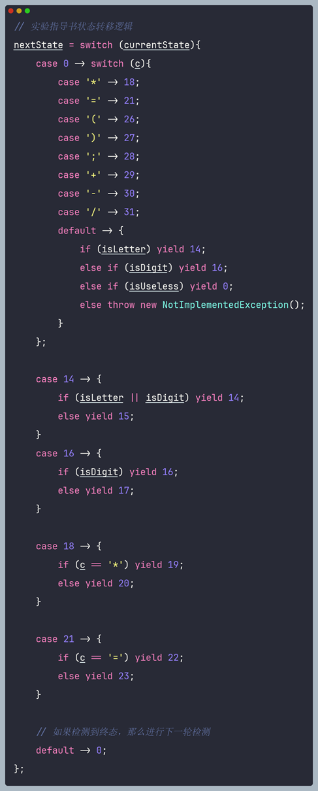
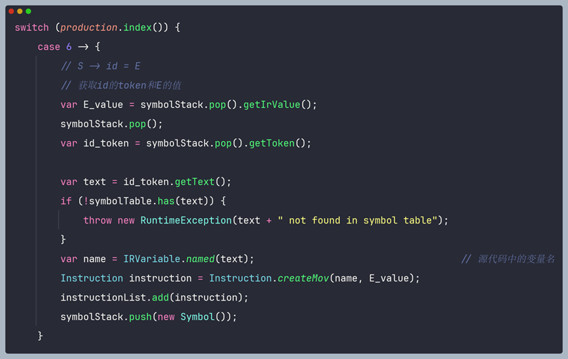
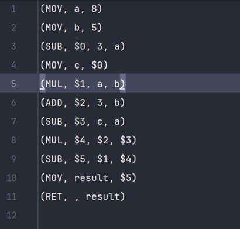

# 编译原理

# 1 实验目的与方法

## 1.1    词法分析器

本次实验目的在于加深对词法分析程序的功能及实现方法的理解。对类C语言单词符号的文法描述有更深的认识，理解有穷自动机、编码表和符号表在编译的整个过程中的应用。通过完善LexicalAnalyzer类，设计并编程实现一个词法分析程序，对类C语言源程序段进行词法分析。

## 1.2 语法分析

本次实验的目的在于深入了解语法分析的实现原理和方法，其中构造文法和语法分析表的步骤省略，主要在于实现语法分析程序。

实验方法：熟练掌握LR(1)语法分析过程，根据语法分析的流程逐步构造并完善程序逻辑，理解框架代码中的各项数据结构，动态调整符号栈和状态栈中的内容，根据栈顶符号和输入符号确定下一步的操作并完成之。

## 1.3  典型语句的语义分析及中间代码生成

本次实验的目的在于加深对自底向上语法制导翻译技术的理解，掌握声明语句、赋值语句和算术运算语句的翻译方法。同时巩固语义分析的基本功能和原理的认识，理解中间代码生产的作用。最后还要理解三地址码的形式，掌握如何构造三地址码。

## 1.4  目标代码生成

本次实验的目的在于加深对编译器总体结构的理解与掌握，掌握常见的RISC-V指令的使用方法以及理解并掌握目标代码生成算法和寄存器选择算法。最终将整个实验生成的汇编代码放入Rars中运行，实现整个简单编译器的搭建。

# 2 实验内容及要求

## 2.1 词法分析器

本实验要求我们编写一个词法分析程序，其过程大致如下：

1、 根据题目要求构造状态转移图和有穷自动机；

2、 读取代码文件，根据状态转移图对文件内的类C语言程序段进行分析，实现对其中的各类词语的分解与识别；

3、 过滤去除无用符号，以二元组的形式输出识别出来的token和符号表并保存在文件中；

## 2.2 语法分析

1、 定于文法并借助编译工作台编写扩展文法。在本次实验中未对给出文法进行任何修改；

2、 利用LR(1)分析法，设计语法分析程序，将实验一输出的符号串作为输入单词符号串进行语法分析。在本次实验中所使用的LR语法分析表均按照默认给出的表格，未进行任何修改；

3、 输出推倒过程中所用产生式序列并保存在输出文件中；

## 2.3 典型语句的语义分析及中间代码生成

本实验要求我们实现语义分析和语法制导翻译的过程，其具体实现过程如下所示：

1、   采用实验二中的文法，为语法正确的单词串设计翻译方案，完成语法制导翻译；

2、   利用该翻译方案，对所给定的程序段进行翻译，并输出生成的中间代码序列和更新后的符号表，最后保存在相应的文件之中；

3、   实现声明语句、简单赋值语句、算术表达式的语义分析和中间代码生成；

4、   使用框架中的模拟器IREmulator验证生成的中间代码的正确性；

## 2.4 目标代码生成

本实验的主要内容是将实验三“典型语句的语义分析以及中间代码生成”输出的中间代码（三地址码）转换为目标代码（汇编指令）。其具体过程如下：

1、   加载前端提供的中间代码，视情况做预处理；

2、   实现完备的寄存器分配算法，代码生成时只使用 t0-t6，最终结果保存到 a0；

3、   实现目标代码生成算法；

4、   输出生成的目标代码到指定文件中；

5、   使用 Rars 运行目标代码，验证其正确性；

# 3     实验总体流程与函数功能描述

## 3.1 词法分析

### 3.1.1      编码表

|类别编码|单词名称|
| ----------| -----------|
|1|int|
|2|return|
|3|=|
|4|,|
|5|Semicolon|
|6|+|
|7|-|
|8|*|
|9|/|
|10|(|
|11|)|
|51|id|
|52|IntConst|

### 3.1.2      正则文法

G=(V,T,P,S)，其中 V={S, A, B, C },T={任意符号, digit, char }，产生式P 定义如下

S-> letter A | B | C

A-> letter A | digit A | ε

B-> digit B | ε

C-> =C | *C | + | - | / | ( | ) | ε

### 3.1.3      状态转换图

​​

### 3.1.4      词法分析程序设计思路和算法描述

首先，我们需要两个辅助列表用于帮助我们辨识当前的状态和输入串的“性质”。在此，我们建立列表finalStates用于存放所有的终态，列表uselessChar用于存放所有的无用符号：

​​

接着，进入此法分析主要程序。在词法分析程序中，我们的主要思想是维持两个指针（即快慢指针），不断向后移动快指针，记录快慢指针之间的token串，通过判断该token串的值来确定状态转移。在该程序中，我们主要维持两个嵌套循环，外层的for循环在于不断迭代慢指针，相当于遍历所有token；内层的while循环用于找到“本次遍历到的token”的位置，即两个指针之间：

​​

在内层循环中，我们首先根据构造的状态转移图编写条件语句，求出“次态”：

​​

求出次态之后，我们需要根据次态来进一步判断是否已经读取完当前token，即次态是否已经是终态了，注意在状态15之中，在本程序段中，字符串有可能是两个关键字return或者int，也有可能是变量名，如果是变量名，我们还需要将它加入到符号表之中：

​​

最后就是添加一些移动指针的逻辑，即快指针不断向后遍历整个单词，当切换下一个单词的时候需要将慢指针移动到快指针的位置进行下一次循环。

## 3.2 语法分析

### 3.2.1      拓展文法

本次实验并未修改拓展文法，仍然按照给出的文法进行分析

P -> S_list;

S_list -> S Semicolon S_list;

S_list -> S Semicolon;

S -> D id;

D -> int;

S -> id = E;

S -> return E;

E -> E + A;

E -> E - A;

E -> A;

A -> A * B;

A -> B;

B -> ( E );

B -> id;

B -> IntConst;

### 3.2.2      LR1分析表

本次实验的LR1分析表通过给出文法在编译工作台中得到：

​​

### 3.2.3      状态栈和符号栈的数据结构和设计思路

首先我们定义状态栈和符号栈，状态栈的定义比较简单，找到状态对应的数据结构Status，创建栈即可；在LR(1)语法分析过程中，符号栈不仅要负责读入输入缓冲区的终结符，还要压入在归约过程中产生的非终结符，但是这两类符号的基类是Object，对我们后续的代码操作并不适合，因此先创建Symbol类，作为栈内元素的类型。Symbol类中既可以传入token类型也可以传入NonTerminal类型，并封装了对应判断字符类型的方法。

​​

在创建完成两个栈之后，还要初始化之。对符号栈的初始化是传入字符串的末位符号eof，对状态栈的初始化是传入状态0.

​​

### 3.2.4      LR驱动程序设计思路和算法描述

LR驱动程序的设计思路关键在于不断循环，查找本次迭代对应的状态和输入符号，并根据状态、输入符号查找LR分析表中，得到当前的action，然后根据action动态调整两个栈，并读入输入字符，进行下一轮循环。

在每一次循环中都要进行的操作是获取当前的状态和输入符号，并根据这两个元素在LR分析表中查找对应的action：

​​

然后就是循环代码中的关键部分，对action做出相应的操作。Action中包括四种情况，分别是移入Shift，归约Reduce，接受Accept和错误Error。

当action为移入Shift时，我们只需要向状态栈中压入action对应的转移状态，再向符号栈中压入本次读入的终结符，不需要归约，下一次循环中读入下一个字符：

​​

当action为归约Reuduce时，我们首先要获得对应的归约产生式production，然后根据产生式右部的长度，从状态栈和符号栈中弹出对应数量的元素，再把归约得到的非终结符压入符号栈。最后，我们还需根据归约得到的非终结符（即产生式production左部）和状态栈栈顶元素在GOTO表中获得转移状态，并将其压入状态栈中。需要注意的是，由于归约操作中并没有读入输入字符，在下一次循环中仍需读入本次的输入字符，因此对循环参数i减一表示指针不动。

​​

最后如果是Accept或者Error，都结束程序，正常返回或者抛出异常。

## 3.3    语义分析和中间代码生成

### 3.3.1      翻译方案

根据grammer.txt文件中的语法产生式，我们可以得到处理综合属性的语法制导翻译，自底向上的翻译方案：

|序号|翻译方案|
| ------| ---------------------------------------------------------------------------------------|
|1|P -> S_list;|
|2|S_list -> S Semicolon S_list;|
|3|S_list -> S Semicolon;|
|4|S -> D id{p = lookup(id.name); if p != nil then enter(id.name, D.type) else error; };|
|5|D -> int {D.type = int};|
|6|S -> id = E {gencode(id.val, ‘=’, E.val);  S.val=E.val};|
|7|S -> return E {gencode(return, E.val)};|
|8|E -> E1 + A {gencode(E.val,‘=’,E1.val,‘+’,  A.val)};|
|9|E -> E1 - A {gencode(E.val,‘=’,E1.val,‘-’,  A.val)};|
|10|E -> A {E.val = A.val};|
|11|A -> A1 * B {gencode(A.val,‘=’,A1.val,‘*’,  B.val)};|
|12|A -> B {A.val = B.val};|
|13|B -> ( E ) {B.val=E.val};|
|14|B -> id {B.val = id.val};|
|15|B -> IntConst {B.val = IntConst.lexval}|

### 3.3.2      语义分析和中间代码生成的数据结构

在语义分析和中间代码生成的环节，我们定义了三种数据结构。symbolTable是符号表，instructionList用于存放生成的中间代码（三地址码）；最重要的结构是symbplStack符号栈，其内部元素的类型Symbol是我自己定义的一个基本类型，其中包括token, nonterminal, irValue和sourceCodeType四种类型的成员：

​​

通过构造这样一个符号栈，我们便可以将移入过程中的所有符号记录在这个栈中（包括irValue和token），然后再reduce的时候弹出自底向上传递数据：

​​

### 3.3.3      语法分析程序设计思路和算法描述

在shift过程中，我们只需要把产生式右部的符号依次压入栈即可：

​​

在reduce过程中，由于每个产生式的右部长度不同、结构不同，因此我们需要具体分析，其大致过程都差不多，故在此处我们只挑选两种情况进行讲解。首先我们根据当前归约使用的产生式序号来分不同情况，第一种情况是==S-&gt;id=E==。此时栈顶三个元素就是产生式右部的三个符号，我们将其依次弹出，其中`getIrValue()`​和`getToken()`​都是symbol类自带的返回特定类型成员的方法，注意<kbd>=</kbd>​符号对我们来说是无用的，因此中间需要一个空pop弹出<kbd>=</kbd>​，再获得id的token。最后再根据语法制导翻译方案产生中间代码instructions，记得向栈中压入一个空符号。

​​

再看产生式11：==A-&gt;A*B==。与上述过程一样，我们想从栈中取出B和A的值，记得弹出无用符号<kbd>*</kbd>​，然后根据语法制导翻译方案，生成对应的中间代码，注意此处需要用一个临时寄存器存放AB的值，且最后需把该寄存器给压入符号栈，实现自底向上的信息传递。

​​

如果不属于代码中的几种情况，即产生式中不存在赋值活动的，比如grammer文件中的前五条：

​​

我们按照以下方式处理：将栈顶产生式右部长度个数的元素全部弹出，它们没有传递数据的作用，并且最后压入一个空符号。

​​

## 3.4    目标代码生成

**3.4.1 设计思路和算法描述**

观察实验三产生的中间代码，我们可以发现，一共出现了5种类型的中间代码指令，因此我们只需要遍历所有的中间代码，并对不同类型的指令制定不同的翻译成等价的汇编指令方式即可：

​​

我们定义了三个数据结构：

​​

然后定义三个辅助函数。其中`findVariableFromReg()`​方法用于找到变量所在的寄存器，如果没有找到则返回-1；`ifHasFreeReg()`​判断是否还有空闲的寄存器；`writeVariable2Reg(IRVariable variable) ​`​将变量写入寄存器，如果没有空闲的寄存器则占据一个。

然后就根据不同的中间代码指令类型进行不同的操作，在此我们不过多赘述，因为每一种指令的操作方式都大致相同，只挑选其中一个详细介绍。在下面这段代码中，我们实现了将MOV型中间指令转化为汇编指令。首先，我们知道mov型指令有两种情况，一种是<kbd>mov reg, imm</kbd>​，另一种是<kbd>mov reg, reg</kbd>​，因此我们首先根据这条指令的`getFrom()`​方法分辨指令的mov类型。如果是立即数移入寄存器的情况，我们只需要将数据写入一个寄存器并且获得该寄存器序号即可，并且构造对应的汇编指令。如果是两个寄存器的情况，我们同样是先判断这两个变量有无在七个寄存器之中，如果没有的话需要给他们分配寄存器，并记录分配的寄存器的序号，通过序号来构造汇编代码。最后我们还需要释放临时寄存器，就是说，如果我们是把一个临时寄存器中的值mov到另一个寄存器中，那个临时寄存器就没用了，我们就可以释放之。

值得一提的是，在SUB类型的中间代码类型之中，我们要分辨当LHS为立即数时，应该将立即数先存入一个临时寄存器，再将临时寄存器与RHS相减；当RHS为立即数时，我们直接<kbd>addi LHS, -imm</kbd>​即可。
